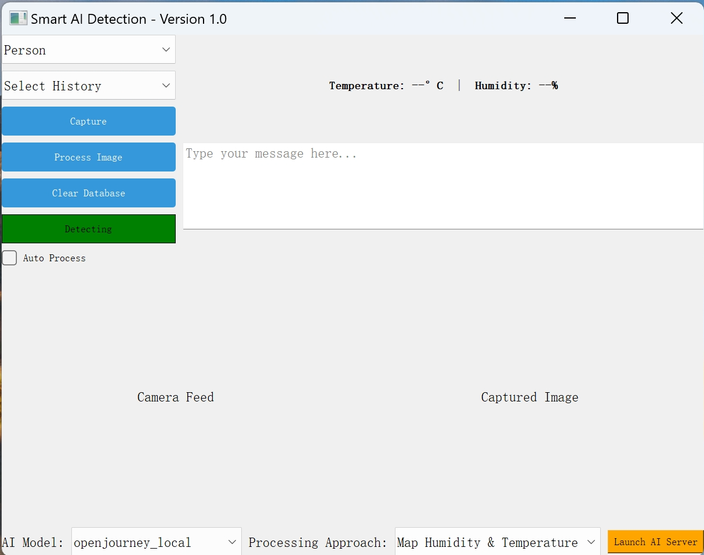

# Smart AI Displayer (SAD)

## Overview
SAD is a **smart AI-based detection and capture system** that integrates **YOLO object detection, Firebase for image storage, AI processing, and MQTT for real-time image delivery**. The system is designed to generate and display AI processed images on a Raspberry Pi-connected LED screen based on deteced object image, text prompt, real-time temperature and humidity readings.

## Features
- **Object Detection**: Uses YOLOv5 to detect user-selected objects (e.g., person, tie, car, dog) through a camera.
- **Firebase Integration**: Captured images are stored in Firebase Storage for later use.
- **AI Processing via HTTP**: The Raspberry Pi sends metadata to an AI server that retrieves images from Firebase and processes them.
- **MQTT Communication**: AI-processed images are sent back to the Raspberry Pi via MQTT for display.
- **Temperature & Humidity Monitoring**: Real-time sensor data is displayed in the UI.
- **User Interface (UI)**: Provides an intuitive UI for object selection, image display, and interaction.

## System Architecture
1. **User selects an object** (e.g. person) and enters optional text.
2. **The camera captures an image** when the selected object is detected.
3. **The image is uploaded to Firebase Storage**.
4. **Metadata (temperature, humidity, user text) is sent via HTTP to the AI server**.
5. **The AI server sends the processed image to the Raspberry Pi via MQTT**.
7. **The Raspberry Pi displays the AI-generated image on an LED screen**.

## Installation after clone
## 1️⃣ Raspberry Pi Zero Setup

### **Step 1: Update & Install Dependencies**
Before setting up the environment, ensure your Raspberry Pi is up to date:
```bash
sudo apt update && sudo apt upgrade -y
sudo apt install -y fbi startx python3-venv python3-pip libjpeg8-dev cmake
python3 -m venv venv
source venv/bin/activate
pip install -r requirements_pi.txt
```
### **Step 2: MJPEG-Streamer Setup (For Camera Streaming)**
```bash
cd ~
git clone https://github.com/jacksonliam/mjpg-streamer.git
cd mjpg-streamer/mjpg-streamer-experimental
make
sudo make install
mjpg_streamer -o "output_http.so -w ./www" -i "input_raspicam.so -x 1280 -y 720 -fps 30"
```
You can access the live stream via: http://<RaspberryPi_IP>:8080/?action=stream

### **Step 3: Update Raspberry Pi IP in Configuration File**
   - In `config/setting.json`:
     ```python
     "raspberry_pi_ip": "192.168.141.100"
     ```
Replace the IP with your raspberry pi's IP which can be found with
```bash
hostname -I
```

### 2️⃣ Local Setup
```bash
pip install -r requirements_ui.txt
```
### 3️⃣ Set Up AI server
```bash
cd ai_server
pip install -r requirements.txt
python download_ai.py
```


### Firebase Setup
1. **Create a Firebase Project**  
   - Go to the [Firebase Console](https://console.firebase.google.com/), create a new project (or use an existing one).

2. **Enable Realtime Database**  
   - In the **Build** section of the Firebase console, select **Realtime Database** and click **Create Database** if it’s not already enabled.
   - Follow the prompts to configure read/write rules as desired (or keep defaults for testing).

3. **Download the Service Account JSON**  
   - Navigate to **Project Settings** > **Service Accounts** > **Generate new private key**.
   - Save the JSON file to `config/firebase_config.json` (or wherever your code expects it).

4. **Replace the databaseURL in `config/setting.json`**  
   - Replace `"https://your-project-id.firebaseio.com/"` with your **Realtime Database** URL, found in your Firebase console (e.g., `"https://<PROJECT_ID>-default-rtdb.firebaseio.com/"`).

---

### MQTT Setup (HiveMQ Cloud)
1. **Create a HiveMQ Cloud Account**  
   - Visit [HiveMQ Cloud](https://www.hivemq.com/mqtt-cloud-broker/) and sign up (or log in if you already have an account).

2. **Obtain Broker Details**  
   - In your HiveMQ Cloud dashboard, locate your **hostname**, **port**, **username**, and **password**.  
   - Example:  
     - **Broker/Hostname**: `a1b2c3d4e5f6.s1.eu.hivemq.cloud`  
     - **Port**: `8883` (TLS)  

3. **Update Your MQTT Config in Code**  
   - In `config/setting.json` where you configure MQTT:
     ```python
     BROKER_URL = "a1b2c3d4e5f6.s1.eu.hivemq.cloud"
     PORT = 8883
     USERNAME = "YourHiveMQUsername"
     PASSWORD = "YourHiveMQPassword"
     "TOPIC1": "ReaingsFromSensor"
     "TOPIC2": "DisplayedImage"
     ```

4. **Specify Topics**  
   - Subscribe to and publish on the same topics across your devices (e.g., `"IC.embedded/***/**"`) so they can communicate properly.
   - Two topics are required for readings and images respectively.
   
5. **Test the Connection**  
   - Run your script and check the console for a successful connection message (e.g. `"✅ Connected to HiveMQ Cloud!"`).
   - If you encounter errors, verify your hostname, credentials, and port number in the HiveMQ Cloud console.


## Running the System
### Run the Raspberry Pi Main Process
```bash
python main.py
```
### Run the UI (on Laptop)
```bash
python ./ui/app_ui.py
```

## AI choices in UI

- **Automatic Object Detection**  
  - Select a model
```bash
pipeline = StableDiffusionImg2ImgPipeline.from_pretrained(
    #"./ai_server/models/sd_v1_5",
    #"./ai_server/models/sd_2_1",
    #"./ai_server/models/dreamlike_photoreal_2",
    "./ai_server/models/openjourney_local",
    torch_dtype=torch.float16
).to("cuda")
```

- **Temperature & Humidity Interference Approaches**
  - Select an approach
  - **Modify Prompt**: Append descriptive phrases to the text prompt based on sensor values.  
  - **Adjust Random Seed**: Derive a custom random seed from the temperature and humidity readings.
  - **Strength & Guidance_scale**: Map sensor values directly to model parameters.


## UI Information


- **Automatic Object Detection**  
  Select a target object (e.g., "Person", "Car", "Dog"). The UI monitors the live camera feed with YOLO, and automatically captures a frame once the chosen object is continuously detected.

- **Real-Time Preview**  
  - **Left Panel**: Displays the camera feed, showing bounding boxes for detections.  
  - **Right Panel**: Shows the most recently captured or AI-processed image.

- **Temperature & Humidity**  
  The UI subscribes to MQTT messages published by the Raspberry Pi, updating temperature and humidity data at regular intervals.

- **AI Processing**  
  After capturing, the UI can send the image (plus optional user text) to an AI server (e.g., Stable Diffusion) via HTTP.  
  Once processed, the AI server publishes the resulting image to MQTT, which the UI automatically displays.

- **Auto Process Checkbox**  
  If this is **checked**, the system **automatically processes** each newly captured image—no need to manually click **“Process Image.”**  
  If **unchecked**, you can still manually trigger processing by clicking the **Process Image** button.

- **History & Database**  
  If images are saved to Firebase, the **History** dropdown lists previously captured timestamps. Selecting one displays that stored image, which can be used for reprocessing or review.

- **Indicator Button (Green/Red)**  
  - **Green ("Detecting")**: System is actively looking for the selected object.  
  - **Red ("Captured")**: Detection is paused to prevent repeated captures. **Clicking the red button re-enables new detection**, switching it back to green.

- **Workflow**  
  1. **Launch the UI**: `python ui/app_ui.py`
  2. **Choose the AI Settings** from the dropdown.
  3. **Launch the AI Server**: Click the 'Launch AI Server'
  4. **Select an Object** from the dropdown.  
  5. **Auto-Capture** occurs once the chosen object is detected (indicator turns red).  
  6. *(Optional)* Click the **red indicator** to reset detection.  
  7. **Process Image** (manually or automatically if the Auto Process box is checked).  
  8. **View Processed Result** in the **right panel**.

- **User Text Input**  
  A text area for prompts or notes included with the image (e.g., style prompts for Stable Diffusion).

## Future Improvements
- Add more object detection categories.
- Enhance AI processing with style transfer for artistic effects.
- Implement Web UI for remote control.

